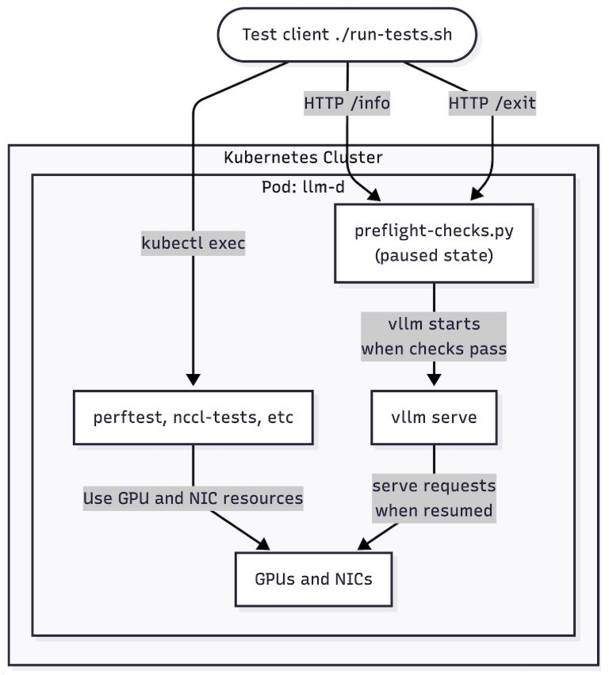

# Design rationale for preflight checks script


When running llm-d getting optimal performance is the top priority. In particular verifying that networking in a deployed llm-d model is getting expected
performance numbers may be difficult. The bandwidth and latency that llm-d pods actually see is determined by a long chain of choices: pod scheduling, NIC selection, RDMA device binding, kernel and driver versions, and environment configuration. A small misconfiguration in any of these can silently cost half the bandwidth or increased latency — and the symptom typically shows up as elevated TTFT, not as an obvious networking error. To close the gap between networking potential performance and production behavior, llm-d operators need a way to validate the actual network path *before* vLLM starts serving traffic. To make this easier, we have developed an approach that lets operators validate network health directly from within the pods where llm-d models will actually run, with minimal extra setup.

To run tests before vLLM is started by llm-d, we use a “preflight” check script. The script gates execution of vLLM by running just before it starts: if all preflight checks succeed, the vLLM process inside the pod starts as before. The preflight checks are designed to run quickly so they do not materially delay llm-d model execution (at most a few seconds added). And they can be easily extended to add additional checks as needed.

If there are problems with Kubernetes pod networking or GPU configuration, the preflight check script has an option to exit with a non-zero status, preventing vLLM from running and causing the pod to terminate so that Kubernetes can reschedule it — hopefully onto a node whose hardware resources satisfy the preflight requirements. This approach works by modifying the pod container startup to invoke our preflight script just before vLLM starts (it uses “&&” to stop `vllm serve` if any preflight check fails):

```
containers:
  - args:
    - "... python3 llm-d-preflight-checks.py && vllm serve /model-cache/models/…
```

The preflight script can also pause execution if more complex networking tests are needed. In this mode, GPU memory is fully available for testing because vLLM has not started running. This behavior is controlled by the LLMD_PREFLIGHT_CHECKS environment variable:

```
   env:
    - name: LLMD_PREFLIGHT_CHECKS
      value: pause
```

You can see how the components work together as shown in this diagram:



Once networking tests are finished, users can signal the pods that preflight checks are complete and execution should resume into vLLM. To end the pause, send an HTTP POST request to the `/exit` endpoint exposed by the preflight checks script.

The preflight check script is packaged as a skill that can be invoked from AI coding agents via `/llm-d-preflight-checks` from `skills/` directory. We are also working to make the preflight scripts option available as an option in the llm-d Helm charts see issue [Add Helm values for mounting ConfigMap scripts and customizing vLLM entrypoint arg](https://github.com/llm-d-incubation/llm-d-infra/issues/286). 

Once the preflight checks are running and have paused `vllm serve` execution, we can run tests to verify the networking setup inside the pods. Operators can use `kubectl exec` to enter the pods and run any tests such as `iperf3` or `perftest` — because vLLM execution is paused, they have full access to the exact environment and hardware setup that vLLM would be using, so the tests run in the same runtime environment as vLLM.

Apart from preflight checks, to automate testing, we also provide scripts and an AI skill that walk through running tests in llm-d pods. The tests are available by running `run-tests.sh` and as a skill `/llm-d-networking-tests` in skill/ directory. If you have questions about the tests and preflight checks, join the llm-d Slack and help us improve the skills and scripts. Example prompts to use with AI coding agents to run networking tests using quickstart guide: 


```
follow https://llm-d.ai/docs/getting-started/quickstart to install llm-d in llm-d-quickstart namspace and run /llm-d-preflight-checks in that namespace to use preflight checks script in installed pods. if necessary add or modify or locally load helm chars to add preflight checks script and env variable LLMD_PREFLIGHT_CHECKS with "pause"
```

```
run /llm-d-networking-tests on those pods
```

```
unpause all pods that have preflight checks scripts running use  /llm-d-preflight-check and verify that all pods are running vllm
```
