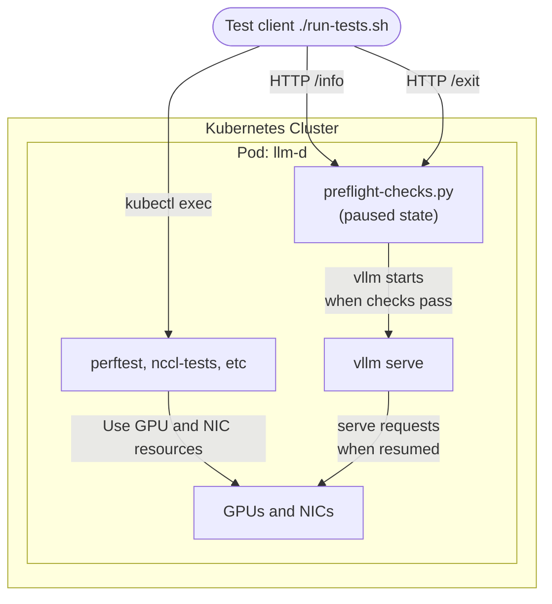

```mermaid
graph TD
    subgraph "Kubernetes Cluster"
        subgraph pod["Pod: llm-d"]
            preflight["preflight-checks.py
            (paused state)"]
            vllm["vllm serve"]
            exec["perftest, nccl-tests, etc"]
            resources["GPUs and NICs"]
        end
    end

    user([Test client ./run-tests.sh])

    user -- "kubectl exec " --> exec
    exec -- "Use GPU and NIC resources" --> resources
    user -- "HTTP /info" --> preflight
    user -- "HTTP /exit" --> preflight
    preflight -- "vllm starts
    when checks pass" --> vllm
    vllm -- "serve requests
    when resumed" --> resources
```
